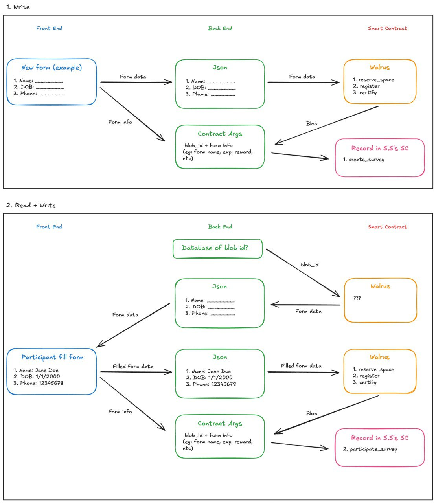

# walrus-backend

# Architecture Draft Overview

## Web3 Survey backend project in Go

### Function APIs List that Frontend need to call from

 * CreateForm(title, description, itemList) -> FormResponse(Json)
 * GetForm(formId) -> FormResponse(Json)

